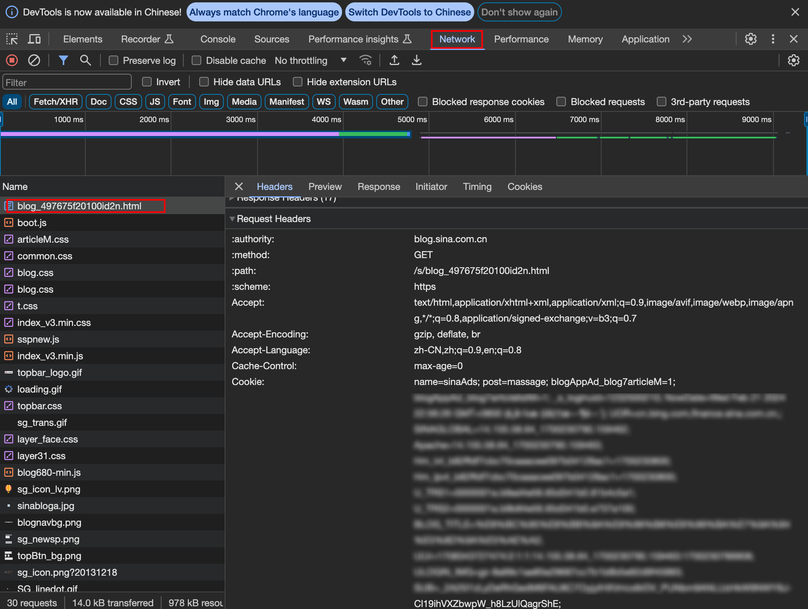

# sina.blog.articles.bak

**<font color=red>People Die, but Long Live GitHub.</font>** </br>
新浪博客临近倒闭，故早年间的絮絮叨叨备份至此。

## 使用说明
```bash
# 0. 安装 python

# 1. 开启虚拟环境
python -m venv .env
. .env/bin/activate

# 2. 利用requirements.txt安装依赖
pip install -r requirements.txt

# 3. 修改配置文件，见下

# 4. 运行
python python script/main.py
```

## 配置文件修改 `./script/config/config.yaml`
```
blogs:
  # 博文目录下的“全部博文”页面,不需要,可留空
  public_blogs_menu: 
  # 博文目录下的“秘密博文”页面
  private_blogs_menu: https://control.blog.sina.com.cn/blog_rebuild/blog/controllers/articlelist.php?uid=1232500210&p=1&status=5
  # 此处cookies仅供参考，请替换为你的cookies,
  # 登录新浪博客后，浏览器F12->network的请求Header中，见下图
  cookies_str: name=sinaAds; post=massage; ... SINABLOGNUINFO=*; rotatecount=7

# 此处简单使用sqlite3实现，降低依赖
db:
  fileName: sinaBlogArticles.db
```
