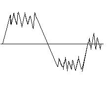

<h2>极端主义</h2>

时间: 2007-06-29 17:28:04 | 分类: [初三日志](./BlogClass_初三日志.md) | 标签: 
<!--
<table>
    <tbody>
        <tr>
            <td>时间: 2007-06-29 17:28:04</td>
            <td>分类: [初三日志](./BlogClass_初三日志.md) </td>
            <td> 标签:  </td>
        </tr>
    </tbody>
</table>
-->

 <wbr/> <wbr/> <wbr/> <wbr/>依旧延续了前天的思想，线型生活，几何人生，人生几何。

 <wbr/> <wbr/> <wbr/>
“极端主义”这骇人心弦的词语想必是很少被人提及的。但它却总也与历史同步向前。

 <wbr/> <wbr/> <wbr/>
极端主义者虽然骇人听闻，但终究还是有让我羡慕的。即便是违背伦理道德，他们也再所不惜。

 <wbr/> <wbr/> <wbr/>
唐代才女（尽管不恰当，但总好过用“荡妇”之类的词语来形容她）鱼玄机少时作诗便深得温庭筠喜爱，收为徒儿。后又做了位官人的填房。官人正房老婆不乐意。她便沦落到尼姑庵中。终日饮酒怍诗寻欢作乐，放荡度日。最终因一男子而将其手下的一小尼姑杀害，郎当入狱。

 <wbr/> <wbr/> <wbr/>
一位本可以同谢道韫、李清照相媲美的鱼玄机因落魄的生活而走上极端，最末只留下个“荡女”的称号。

 <wbr/> <wbr/> <wbr/>
香港影星张国荣更是极端主义的代表人物。他栖身与影界歌坛，附带着一双忧郁的眼神颓废生活。从不在意他人的评价，敢爱敢恨。以至于三年前的愚人节的惨案。一段令世人敬佩叹服的人生就此戛然而止。

 <wbr/> <wbr/> <wbr/>
一个叱咤风云的人物唯留下他的歌让我们缅怀。

 <wbr/> <wbr/> <wbr/>
极端主义者无法平静的生活，于是他们选择了极端的生活。追寻自己理想的生活，尽管那生活越过了伦理，但他们依旧我行我素，追寻他们所谓的自由，不曾顾及路人异样的眼光，也无暇顾及路人异样的言论。

 <wbr/> <wbr/> <wbr/>
极端主义极端到无法触及，因而更让我们所羡慕。

