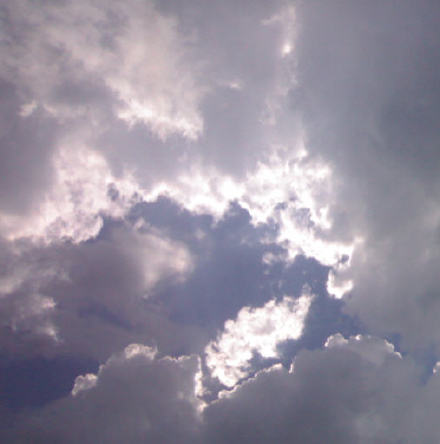

<h2>海天图志</h2>

时间: 2007-07-08 23:13:26 | 分类: [怡游悠哉](./BlogClass_怡游悠哉.md) | 标签: 旅游,两相伴,蓝天,碧海
<!--
<table>
    <tbody>
        <tr>
            <td>时间: 2007-07-08 23:13:26</td>
            <td>分类: [怡游悠哉](./BlogClass_怡游悠哉.md) </td>
            <td> 标签: 旅游,两相伴,蓝天,碧海 </td>
        </tr>
    </tbody>
</table>
-->

 <wbr/> <wbr/>

又是一个出行的好天气。

大路朝天，各走一边？

 <wbr/> <wbr/> <wbr/> <wbr/> <wbr/> <wbr/> <wbr/> <wbr/> <wbr/> <wbr/> <wbr/> <wbr/> <wbr/> <wbr/> <wbr/>

烈日炎炎，天似穹炉，笼罩四野。

骄阳安能如此无情？

 <wbr/>

群云漫天，形如洞天。

云天纠结，终无了解。

 <wbr/>

东边日出西边雨，道似无晴却有晴。

 <wbr/>

少有的蓝天。

蓝天，忧郁的有些恐怖。

恐吓的它物淡出蓝天。

 <wbr/>

海似不枯，石如不烂。

友谊如何不能永久不变？

 <wbr/>

零星点点，水光潋滟。

水色湛蓝，只因蓝天陪伴。

 <wbr/>

碧海蓝天，圆岛长岸。

地壳运动，怎可永久做伴？

 <wbr/>

 <wbr/>

海中孤岛，神话不断。

形如火山，永久休眠。

无奈人事今已非，犹有海水久缠绵。

 <wbr/>

夕阳西下，天空泛起了粉艳。

贾人出海，携家老小，

踏进彩虹的彼岸。

 <wbr/>

玉兔苦无眠，人间走一番。

留恋海天连，长伴水陆间。

