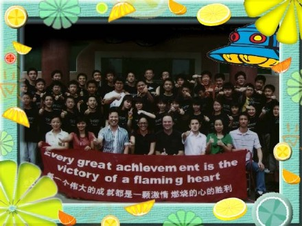

<h2>去年今日</h2>

时间: 2007-08-15 19:27:28 | 分类: [六柳呓语](./BlogClass_六柳呓语.md) | 标签: 校园生活,rockybox,结业,b4,梁祝
<!--
<table>
    <tbody>
        <tr>
            <td>时间: 2007-08-15 19:27:28</td>
            <td>分类: [六柳呓语](./BlogClass_六柳呓语.md) </td>
            <td> 标签: 校园生活,rockybox,结业,b4,梁祝 </td>
        </tr>
    </tbody>
</table>
-->

<bgsound balance="0" loop="infinite" src="http://club.noahedu.com/UploadFile/2007-4/200746982075279.mp3" volume="0"/>

 <wbr/> <wbr/> <wbr/>
去年今日,我们结业了。

 <wbr/> <wbr/> <wbr/>
今天，我又穿上了那件印有“Nothing in the world can take the place of
persistence！”的黑色衬衫，翻开那本薄薄的笔记本，看着那些熟悉的浅蓝色字迹，于是那些浅蓝色的记忆又涌上了心头，将我的思绪浸没。

 <wbr/> <wbr/> <wbr/>
思绪乘着歌声回到了浅蓝色的去年今日。

 <wbr/>

 <wbr/> <wbr/> <wbr/> <wbr/> <wbr/> <wbr/> <wbr/> <wbr/> <wbr/> <wbr/> <wbr/> <wbr/> <wbr/> <wbr/> <wbr/> <wbr/> <wbr/> <wbr/> <wbr/> <wbr/> <wbr/> <wbr/> <wbr/> <wbr/> <wbr/> <wbr/> <wbr/> <wbr/> <wbr/> <wbr/> <wbr/> <wbr/>
Rocky Box的开始

 <wbr/> <wbr/> <wbr/>
杂乱不一的签名留言在自己眼前更加跳跃地杂乱了，嘴中不禁哼起：“Buddy you are a boy make big
noise……”

 <wbr/> <wbr/> <wbr/>
那是我们Rocky Box的班歌。

 <wbr/> <wbr/> <wbr/>
至今依旧清晰地记得那第一天午餐时的情景：老大Kurt带领我们全班四十多名学生一起用手掌拍打着餐桌，然后他以高亢激动的声音高唱《We
Will Rock
You》，于是我们果真撼动了在座的每一位“You”，甚至还包括了我们自己。最后所有的You看着我们将午餐吃完才回过神来。

 <wbr/> <wbr/> <wbr/>
当晚，我们学会了这首班歌，并有了我们班自己的口号“Rocky Box, Rocky Box, We Will Rock
You”以及“啪－啪－啪啪怕－啪啪啪啪――啪啪”的掌声……

 <wbr/>

 <wbr/> <wbr/> <wbr/> <wbr/> <wbr/> <wbr/> <wbr/> <wbr/> <wbr/> <wbr/> <wbr/> <wbr/> <wbr/> <wbr/> <wbr/> <wbr/> <wbr/> <wbr/> <wbr/> <wbr/> <wbr/> <wbr/> <wbr/> <wbr/> <wbr/> <wbr/> <wbr/> <wbr/> <wbr/> <wbr/> <wbr/> <wbr/> <wbr/> <wbr/> <wbr/>三零二宿舍

 <wbr/> <wbr/> <wbr/>
爱耍酷的鹏哥Zrazy、人缘特好的聪哥Lee、总也睡不醒的树熊Rainbow、有七分酷似王力宏的小舍Jacky以及年龄最小的小连Jack，再加上我，我们被随机分到了三零二宿舍，与其说是随机分配，不如说这是一种缘分。

 <wbr/> <wbr/> <wbr/>
六人相处的还算融洽，无休时间以及晚熄灯前我们会轮流玩玩斗地主、锄大地等扑克游戏，熄灯后我们会讲讲冷笑话（印象最深的冷笑话：棉花糖走着走着就飘起来了），谈谈男生们的话题。

 <wbr/> <wbr/> <wbr/>
时不时会有隔壁宿舍的Yellow One
Day八千、Johnny、冠伦等来串门，然后搅得我们宿舍不得一日安宁。偶有一次Johnny看到了我们宿舍窗上一张露背美女的报纸，大呼曰“火辣辣”，于是便有人附和了：“Oh，she
is very very……hot！”最后，舍长Zrazy与Lee居然把它当成了镇舍之宝，将八千等人赶了出来。

 <wbr/>

 <wbr/> <wbr/> <wbr/>
 <wbr/> <wbr/> <wbr/> <wbr/> <wbr/> <wbr/> <wbr/> <wbr/> <wbr/> <wbr/> <wbr/> <wbr/> <wbr/> <wbr/> <wbr/> <wbr/>
 <wbr/> <wbr/> <wbr/> <wbr/> <wbr/> <wbr/> <wbr/> <wbr/> <wbr/> <wbr/> <wbr/> <wbr/> <wbr/> <wbr/>搞怪梁祝剧

 <wbr/> <wbr/> <wbr/>
梁祝搞怪版由我们班两位漂亮的女“猪脚”（从头这样叫她们，而Jessica硬说是她们是“主角”）Jessica和Beryl执导。演员阵容开始时还算盛大，但后来不知为何只剩下了亮、璐和品侨姐。还好多亏了品侨姐演技精湛、舞功了得，再加上他们三人在我们踢乌龙球、看着《僵尸新娘》时的辛苦排演，方使得梁祝甚为完美。亮表演地也不错，可以说是达到了“演员的身体不是自己的”的高深境界。旁白的璐的普通话也十分标准。

 <wbr/> <wbr/> <wbr/>
整部剧中，印象最深的还是那句经典台词：“Give you colour see see！”

 <wbr/>

 <wbr/> <wbr/>
 <wbr/> <wbr/> <wbr/> <wbr/> <wbr/> <wbr/> <wbr/> <wbr/> <wbr/> <wbr/> <wbr/> <wbr/> <wbr/> <wbr/> <wbr/> <wbr/> <wbr/> <wbr/> <wbr/> <wbr/> <wbr/> <wbr/> <wbr/> <wbr/> <wbr/> <wbr/> <wbr/> <wbr/> <wbr/> <wbr/> <wbr/> <wbr/>
驰骋足球场

 <wbr/> <wbr/> <wbr/>
偌大的足球场总是被我们B4的男生所占据，然后由Big
Boss带领一对人马，小舍带领一队人马，摆开阵式，杀将开来。这边Kurt、Peter、猪派以及乌龙球王子，那边小舍、Jack（球场上素有欧文之称），纬诚Rainbow、Zrazy，大战二十回合，最后带着一身臭汗跟着大队浩浩荡荡地回了食堂。

 <wbr/> <wbr/> <wbr/>
偶有一次，乌龙球王子大显神威，将足球一个大脚进了网球场。最后老大和魏教官从底部将网弄开，派一小个子进入才得以取出。

 <wbr/>

 <wbr/> <wbr/> <wbr/> <wbr/> <wbr/> <wbr/> <wbr/> <wbr/> <wbr/> <wbr/> <wbr/> <wbr/> <wbr/> <wbr/> <wbr/> <wbr/> <wbr/> <wbr/> <wbr/> <wbr/> <wbr/> <wbr/> <wbr/> <wbr/> <wbr/> <wbr/> <wbr/> <wbr/> <wbr/> <wbr/> <wbr/> <wbr/> <wbr/> <wbr/>
疯狂的结束

 <wbr/> <wbr/> <wbr/>
结业前夜，B4举行了结业晚会。

 <wbr/> <wbr/> <wbr/>
晚会前，老大教了一首长长的《Seasons in the sun》，以他优美的嗓音与大家告别。

之后，狂欢开始了。

 <wbr/> <wbr/> <wbr/>
老大Kurt与Kingkong一起合奏了首《One night in
Beijing》，教室内的灯光也跟着闪烁，同学们的手臂也跟着挥起来。

 <wbr/> <wbr/> <wbr/>
最后，狂欢达到了最高潮，所有人都跟着条起来，一圈圈拉着火车，狂舞一阵。晚会完全变成了舞会。

 <wbr/> <wbr/> <wbr/>
在没有任何征兆的提醒下，音乐戛然而止，舞会悄然结束了。

 <wbr/> <wbr/> <wbr/>
那晚，冠伦依旧如往常一样，带领着一群B4的同学们在三楼宿舍的走廊上，对着一楼齐声大喊“空姐，空姐，我爱你！”只是今晚更将猖獗了，猖獗到了空姐的门前，猖獗到了大胆表白。直弄得空姐不知如何是好。

 <wbr/> <wbr/> <wbr/>
最终，在魏教官的呵斥下，才平静下来。

 <wbr/>

 <wbr/> <wbr/> <wbr/>
幸福快乐的时光总是短暂的。短暂的时光令人难忘。

 <wbr/> <wbr/> <wbr/>
无法忘记那个有几分Hip-hop的走路风格且常常“Yes”头“Yes”尾的Yebo，无法忘记那个CS与Sex不分并以擅长玩Sex为傲，以致使Wendy老师尴尬万分的Adam，无法忘记那个胖胖乎乎的喊破了嗓子还在报数时“三”的扯嗓子的的生姜……

 <wbr/>

 <wbr/> <wbr/> <wbr/>
去年今日，我们结业了。

 <wbr/> <wbr/> <wbr/>
于是，我们更奔东西。

 <wbr/>

 <wbr/>

 <wbr/>

