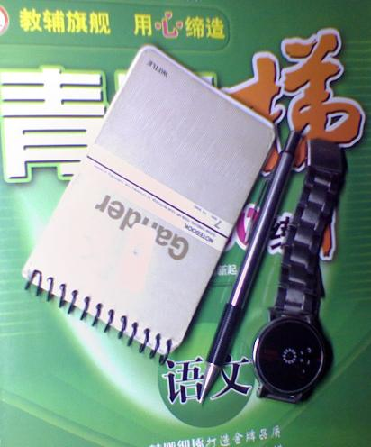

<h2>孤独中的自由</h2>

时间: 2008-08-16 08:04:49 | 分类: [高中日志](./BlogClass_高中日志.md) | 标签: 杂谈
<!--
<table>
    <tbody>
        <tr>
            <td>时间: 2008-08-16 08:04:49</td>
            <td>分类: [高中日志](./BlogClass_高中日志.md) </td>
            <td> 标签: 杂谈 </td>
        </tr>
    </tbody>
</table>
-->

一年之前，也曾写过一篇关于“认识自己”的文章。

如今，时隔一年，重新拿起镜子，开始闭上眼睛审视自己。

我喜欢关注一些故事中的留白部分，无论是电影还是小说，想要看看那些新闻媒体如何评价那些主角们。

寒假的时候，读完了《哈7》，意犹未尽。故事的跨越度太大了，很多东西都还未成有个完整的交代。尤其是是末的“十九年后”讲述得过于精炼了，留白也过大了。还有很多东西需要用我们的想象去填补。譬如哈利如何面对《预言家日报》的采访，如何评价“邓布利多的谎言”，达力一家何去何归等等等等。甚至希望能有像《深圳晚报》那样有份量的相关报道。

去年的《超人归来》中，超人最终冒着生命危险将巨大的结晶岛抛离地球，再度拯救了世界的时候，影片戛然而止。后来呢？美国的报纸如何夸大超人的神力，如何揭秘结晶岛。

《蜘蛛侠Ⅲ》中，当彼得终于于好友重归于好，同肩作战，英勇地战胜了邪恶势力。新闻媒体又是如何揭秘蜘蛛侠，如何评价彼得与好友的那份友谊。

每每如此，我便兴奋无法抑制情感，如同自己便是超人，自己便是蜘蛛侠。

每每如此之后，我便开始思忖：或许我将来很适合当一名新闻记者。每天奔波在外，从南美洲飞到非洲，又从西欧跳到东南亚。做一名战地记者，穿梭在枪林弹雨的战场之上，毫无畏惧地用相机拍摄下炸弹向我飞来的瞬间。

渐渐地，我发现自己错了，原因是我不善言辞。

我错了，我喜欢关注媒体的报道，并不是暗示着我可以做一名优秀的记者，而是说明我太在意他人对自己的看法，太在意他人看自己的眼神了。

我在意的太多了，在意他人对自己的评价，在意他们异样的眼神，甚至于在意他们的一举手一投足，我以为那里面隐含着难以捉摸的意义，以致于在众人面前时，总是拘谨得无法放开手来，担心他们背后的议论。

愈是在意的多，便也就愈加恐惧，愈加逃避。

因而，常常一个人在黑暗中行走，在无人的校园里游荡。因此便有了《六柳寓言》中那个不可一世的六柳。

偶尔，我也回散步到操场。寻找那只与我有着一面之缘的兔子，寻找那只在高处向我求救的小花猫，寻找盛开的凤凰木下零落的怪异种子，寻找那个仰天长笑，展开双臂痴迷旋转的六柳。

官龙脚畔，黯淡昏黄的照明灯下，只有我们两个人——我和我的影子，再也没有其他的人。此时，无须再在意，无须再做作。没有人在注视你，这里便是我所产生的闭锁轨道。因而，我大可疯狂地苦笑，癫狂地吼叫，学卓别林怪异却幽默的步伐，做出纯六柳式的舞步。累了，便躺在软软的绿茵场上，一颗，有一颗地数着星星。

我知道，这很不合群。但我就是喜欢，喜欢地纯纯粹粹。

我也知道我永远无法摆脱这样的自己，尽管很想像林大班长一样再成绩下跌时边摇头边暗自自已自语：“不以物喜，不以己悲。”但我做不到。说白了，“不以物喜，不以己悲”那不过时范仲淹显示身份的骗人把戏。若真有人能做到如此境界，那他不是死人，就是非人。

我不是死人，也不是非人。因而我的心情天气会随着自己对客观世界的主观感受而或喜或忧，或哭或笑。感情在很大程度上受到外界的遏制，只有在孤独时才真正属于自己。

 <wbr/>

 <wbr/>

图片与文章无关，我的三件宝贝儿（那只铅笔配了我三四年），让我炫耀一下。o(∩_∩)o...

