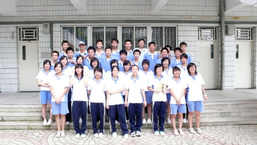

<h2>缘灭的尽头</h2>

时间: 2008-08-23 08:19:02 | 分类: [高中日志](./BlogClass_高中日志.md) | 标签: 不成曲的骊歌,校园
<!--
<table>
    <tbody>
        <tr>
            <td>时间: 2008-08-23 08:19:02</td>
            <td>分类: [高中日志](./BlogClass_高中日志.md) </td>
            <td> 标签: 不成曲的骊歌,校园 </td>
        </tr>
    </tbody>
</table>
-->

 <wbr/> <wbr/> <wbr/> <wbr/> <wbr/> <wbr/> <wbr/> <wbr/> <wbr/> <wbr/> <wbr/> <wbr/> <wbr/> <wbr/> <wbr/> <wbr/> <wbr/> <wbr/> <wbr/> <wbr/> <wbr/> <wbr/> <wbr/> <wbr/> <wbr/> <wbr/> <wbr/> <wbr/> <wbr/> <wbr/> <wbr/> <wbr/> <wbr/> <wbr/> <wbr/> <wbr/> <wbr/> <wbr/> <wbr/> <wbr/> <wbr/> <wbr/> <wbr/> <wbr/> <wbr/> <wbr/> <wbr/> <wbr/> <wbr/> <wbr/>
——小记我的高一

还记得扎到实验时，校门内那壮观的喷泉，校园内熙熙攘攘的人流，操场上挤满的车辆。空气中充斥着喜庆的气味。

还记得课室外，一位父亲让女儿回家后写篇《开学第一天》，于是女儿喜鹊般叫开了。只是，那张面孔我早已忘却。

还记得课室内，我选择了靠窗的第三个位置，可以观望校园，享受阳光，甚至向葱郁的草地幸福地微笑。前方是Mr.Bean，再前方是希圣，后方是猪，右方是○○（请允许我如此称呼，鄙人认为甚为亲切）。

十二班的兄弟们（本有“姐妹”，后以欠妥删之），你还记得这一静一幕吗?

 <wbr/>

这篇别离的笙箫在头脑中酝酿了许久，只是如今才酝酿出几分甘畅香醇。

六柳就是这样，总喜欢回忆，回忆那些藏匿起来的欢乐时光，总喜欢纪念，纪念那些流逝在岁月中的故事。

说实话，开学之初，我一直在为自己的不争气而懊恼郁闷。彼时的六柳曾一度后悔自己的选择，总是在无人的角落里自言自语：“如果当初……”但人生哪有什么回头路，我们都没有多余的草稿纸描绘人生。无奈中，我只能选择放弃懊悔，努力让自己去接收这个班级，去爱上它。

 <wbr/>

翻看记忆的盒子，寻找往昔的影子。

一直生命力顽强的灯泡。那是我们（超、豪、我）最完美的作品。尽管没什么创新感，其实创新的想法还是有很多的，只是被一一否定了。最后选择了最保守的两种方法合二为一。错落的的灯泡在纸制降落伞的保护下从二楼飞了下去。成功。二楼、三楼……五楼。此时广播中传来《天空之城》动听的旋律，降落伞便在这样的浪漫中徐徐旋转着下降。婀娜的身姿，向我们宣布着成功。

这一节课带给了无尽的欢愉，但同样也是这样一节课让我无比尴尬。本来想讲冷笑话，却不幸把自己给冻倒了。作为当事人的你，应该记得吧？关于冰冻的灯泡。

一架桐木制的残桥。那是我们“坏人团”（雄、达达、我）最失败的创作。由本人一手策划，以打破校记录为最终目标。但最终却以17公斤的成绩告败。还在没有参加科技节，不然真得去找地缝了。很佩服体委跟B哥的“大力神”，竟能承受一百三十多公斤的杠铃。

一个畸形的T2噬菌体的模型。那是我们（由、琴、超、我）劳动的结晶。单单是它那用纸插成的臃肿的菠萝身体，就几近让我们抓狂。由，你这个完美主义者，终于还是在我们的“帮助”下做了只超反理想的东西。说实话，就连萃莘、D欣她们的巨大艾滋病菌都比我们的要完美。

一份名为《心路》的剧本。那是我们心理课上一次不太成功的表演。鄙人毕成才，一个孤僻的高中生。雄跟汝哥本色表演。猪猪导演兼老师。Mr.Bean和晓玲的神五神六。多亏了晓玲无厘头式的结尾，否则我还真不知如何收笔。

一张“最佳创意奖”的合唱奖状。一条黄色的弹性大绳。一份《情歌王》的歌词。一个永远的果冻（MT）。

傅。我高一一年永远唯一的同桌。总喜欢像个白痴一样讲笑话给你听，因为你爽朗的笑声，因为你甜美的微笑。记得我们动作——打。点。时。器。

希圣。一个让人羡慕+仰慕的家伙，我们320的成员。成绩第一也就罢了，可他却样样都想争第一，连班内人拍拖，他也抢第一个。令人无言的家伙。

黄三金。班中乃至校中的体育健儿。下届校运会时，一定要拿下三金的愿望噢！还有，以后别在足球场上假摔了。尽管我们都知道你是为了班级，但毕竟那样对别人来说不够公平，对我们自己也不算光彩，对你的身孕（是身孕还是生育？哦！是生育）（声誉）也很有影响，要赢就要赢得让他们心服口服俯首称臣五体投地。

还有……伶牙俐齿的阳芷，尽职尽责的班长，沉默寡言的俊盛，娇小可爱的嘉嘉，冷若冰山的蛋蛋（音）……与六柳一同抗击火星人从后门入侵的雨凡，最后被猪猪揭露虚伪丑恶嘴脸的剑眉（怎么着不服不服过来打我呀笨），还有没放假便跑去看奥运的孙中山……还有老大，抱歉，最后才提及您老人家，老大别动法宝。

 <wbr/>

最后，我独自一人在不大也不大干净的黑板上写下“高飞”二字。

其实，我是自私的。我希望能有更多的同学留言，以完成我初二时的循环。只是，那两个孤单的大字静静地等待了很久，也未成有留言的色彩。终于，还是傅完结了我的心愿。尽管那几行字并没有期望中的那般完美，但好歹心愿已了。

最后的最后，我打开了课室外的柜子。拿出那只肩背降落伞的灯泡，孤伶伶的径直上了五楼，将它轻轻放下。只是天公不作美。暴烈的阳光，万碧的晴空，一丝风都没有。灯泡落下，依旧顽强的存活着。但愿我们的友谊也能如此。

 <wbr/>

又是一首不成曲的骊歌。

在离别的时刻，我才恍然大悟。

12班……六柳66……6+6=12

六柳笑了，没心没肺的笑了。

原来这一切都早已注定，无论是当年的三年六班，还是如今的十二班，都是我命中的缘。缘让我与十二班的这群人相遇相知。

 <wbr/>Ps.这或许将是高一的最后一篇文章，仅仅只是或许。

 <wbr/>Pps.我怎么被挡住了？

