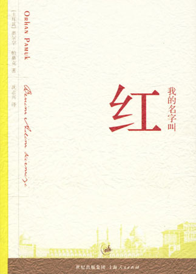

<h2>只有九天的故事</h2>

时间: 2008-08-26 09:00:21 | 分类: [六柳读书](./BlogClass_六柳读书.md) | 标签: 我的名字叫红
<!--
<table>
    <tbody>
        <tr>
            <td>时间: 2008-08-26 09:00:21</td>
            <td>分类: [六柳读书](./BlogClass_六柳读书.md) </td>
            <td> 标签: 我的名字叫红 </td>
        </tr>
    </tbody>
</table>
-->

 <wbr/> <wbr/> <wbr/> <wbr/> <wbr/> <wbr/> <wbr/> <wbr/> <wbr/> <wbr/> <wbr/> <wbr/> <wbr/> <wbr/> <wbr/> <wbr/> <wbr/> <wbr/> <wbr/> <wbr/> <wbr/> <wbr/> <wbr/> <wbr/> <wbr/> <wbr/> <wbr/> <wbr/> <wbr/> <wbr/> <wbr/>
——读《我的名字叫红》

只有于字里行间思考方谓之读书。而读书的最好方法便是在读完一本书之后思考它的名字。

正如，奥尔罕·帕默克的这本书为什么叫《我的名字叫红》？

尽管书中并没有过多的笔触谈及红，但“红”却已经透露给了我们很多很多。

红，是鲜血，是一场谋杀。

红，是玫瑰，是一场爱情。

红，是颜料，是一幅画作。

 <wbr/>

故事在死人的讲述中开始。

十六世纪末，离家十二年的黑回到了故乡——伊斯坦布尔，迎接他的除了表妹谢库瑞的爱情，同时还有接踵而来的谋杀案，先是画师高雅先生被丧尸深井，接着是奉命为苏丹陛下秘密绘制抄本的黑的姨父——谢库瑞的父亲也惨遭杀害，姨父大人的最后一幅画也被偷了。苏丹给了黑三天的期限以找出凶手，否则，画坊的所有画师以及黑都将受到严刑拷问。黑跟随奥斯曼大师看了一天的细密画，也没看出什么名堂，第二天他们要求进到苏丹陛下的藏宝库里翻阅古籍，有了蛛丝马迹，奥斯曼大师以他对三位爱徒的了解，认定“橄榄”是凶手，但他更愿意把“鹳鸟”交给侍卫队长。最后，还只有半天的时间，恰是深夜，黑救回了哈桑家的谢库瑞与两个孩子，又挨个搜查了三位画师，却没有找到他想要找的。最后的最后，凶手被抓了出来，却不幸从他们手中逃了。拿着红宝石剑的哈桑误打误撞杀了凶手，以为自己杀了好人，出逃在外。末了，故事圆满大结局。

其实我不敢说我读懂了这本书，我仅仅只知道这样的一个故事，这样一个包含着哲学、艺术、爱情的故事，但我却不知道书中的一举手一投足在伊斯坦布尔意味着什么，更不知道细密画在十六世纪的大布里士有何等的地位。就像外国人读《红楼梦》一样，我观赏着这本来自土耳其的《红楼梦》。

虽然如此，但我坚信，敢想才有感想。

这是一本历史书。

讲述了这段了土耳其插画艺术的衰亡。而历史便是书中的故事。

这是一本哲思书。

书中通过橄榄、鹳鸟、蝴蝶以及奥斯曼大师，分别阐述了自身对时间、记忆、签名、失明、风格的理解。对于细密画师们而言，失明是他们最大的荣誉，是真主安拉对他们的恩赐，即便是失明，他们也依旧可以凭借着记忆，将真主安拉眼中的世界描绘在纸上。风格对一个细密画家而言是一种耻辱，他们都摒弃自己的风格，摒弃创新，甚至从不曾签名，签名也是一种耻辱。晚年的毕萨德为了保持自己一贯的风格，甚至用针刺瞎了自己的眼睛。而故事中奥斯曼大师为了保持一个画坊的风格，不惜牺牲自己的三位爱徒，终了，他也刺瞎了眼睛。

是否该遗弃旧的绘画风格及技巧，迎接法兰克人绘画技巧？这是对整个土耳其文化的思考。

这是一本爱情小说。

黑回到了伊斯坦布尔，他心底的那份深藏了十二年的爱情火苗重新燃起熊熊的火焰。像席琳与胡斯莱夫的故事一样，骑着白马的黑望着开窗望向他的谢库瑞。姨父大人被杀后，出于对凶手的恐惧及夫家的强迫，他们简单地举行了婚礼，谢库瑞却不得不以找出凶手为条件。终于，他们平凡的生活开始。

书中无数次的重复出现“席琳与胡斯莱夫”这对情侣的故事。奥尔罕·帕默克重复讲述这个我们都很陌生的爱情故事，向世界展示自己名族的古老文化。呈现在读者面前的还有无数的伊斯兰教区的故事：大名鼎鼎的鲁斯坦、细密画大师毕萨德、诗人扎米……真实与虚构的故事相互交错。

与其说它是一本故事书，莫如说它是一本故事集，像《一千零一夜》一样大故事中穿插着小故事。又如一本伊斯兰世界的大百科全书，无声地讲述着伊斯坦布尔的伊斯兰文化。

其实原因不仅仅是因为“红”暗示了一场谋杀，一场爱情，一幅画作，同时也暗示了作者的写作风格——以当事人的视角、以说书人的话语讲述故事的始末。没有章节，却有十数个主角轮番上阵，让读者所知的信息量更加庞大，使得主讲人随心所欲地讲述，甚至是自己的主观感受、胡思乱想、个人隐私。当然，凶手主讲时例外。也正因为如此，我才能真切地感受到几位画师的自以为是、羡慕、妒忌，甚至是怨恨。三位画师都认为自己是最最才华横溢，艺术水平最高的一位。

如此，我们才能感受到人物是如此的真实。

另外，为了故事的真实性，奥尔罕·帕默克不惜花费大笔墨来描述一幅幅细密画的内容，一个个人们所不了解的故事。

但人死后依旧在讲述，甚至大肆描述死后的世界。似乎又在告诉我们，这仅仅只是一个故事。正如古希腊的戏剧中的主角告诉我们“我将会在第四幕死去”一样。

矛盾丛生。生活不也充满矛盾吗？正如书中的谢库瑞对黑充满爱意，却写给黑“不要多想”的书信。

如此，我们才感受到故事似乎真的如是发生过。

 <wbr/>

ps.似乎仅仅只是在复述故事。

