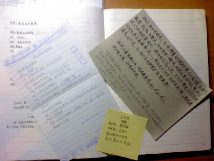

<h2>花非花</h2>

时间: 2008-11-16 08:37:04 | 分类: [高中日志](./BlogClass_高中日志.md) | 标签: 空,校园
<!--
<table>
    <tbody>
        <tr>
            <td>时间: 2008-11-16 08:37:04</td>
            <td>分类: [高中日志](./BlogClass_高中日志.md) </td>
            <td> 标签: 空,校园 </td>
        </tr>
    </tbody>
</table>
-->

 <wbr/> <wbr/> <wbr/> <wbr/> <wbr/> <wbr/> <wbr/> <wbr/> <wbr/> <wbr/> <wbr/> <wbr/> <wbr/> <wbr/> <wbr/> <wbr/> <wbr/> <wbr/> <wbr/> <wbr/> <wbr/> <wbr/> <wbr/> <wbr/> <wbr/> <wbr/> <wbr/> <wbr/> <wbr/> <wbr/> <wbr/> <wbr/> <wbr/> <wbr/> <wbr/> <wbr/> <wbr/> <wbr/> <wbr/>
花非花

 <wbr/> <wbr/> <wbr/> <wbr/> <wbr/> <wbr/> <wbr/> <wbr/> <wbr/> <wbr/> <wbr/> <wbr/> <wbr/> <wbr/> <wbr/> <wbr/> <wbr/> <wbr/> <wbr/> <wbr/> <wbr/> <wbr/> <wbr/> <wbr/> <wbr/> <wbr/> <wbr/> <wbr/> <wbr/> <wbr/> <wbr/> <wbr/> <wbr/> <wbr/> <wbr/> <wbr/> <wbr/> <wbr/> <wbr/> <wbr/> <wbr/> <wbr/> <wbr/> <wbr/> <wbr/> <wbr/> <wbr/>
白居易

 <wbr/> <wbr/> <wbr/> <wbr/> <wbr/> <wbr/> <wbr/> <wbr/> <wbr/> <wbr/> <wbr/> <wbr/> <wbr/> <wbr/> <wbr/> <wbr/> <wbr/> <wbr/> <wbr/> <wbr/> <wbr/> <wbr/> <wbr/> <wbr/> <wbr/> <wbr/> <wbr/>
花非花，雾非雾，夜半来，天明去。 
 <wbr/> <wbr/> <wbr/> <wbr/> <wbr/> <wbr/> <wbr/> <wbr/> <wbr/> <wbr/> <wbr/> <wbr/> <wbr/> <wbr/> <wbr/> <wbr/> <wbr/> <wbr/> <wbr/> <wbr/> <wbr/> <wbr/> <wbr/> <wbr/> <wbr/> <wbr/> <wbr/> <wbr/> <wbr/> <wbr/> <wbr/>
来如春梦几多时，去似朝云无觅处。

恍惚间，似乎又看到了往昔的那个你：突出的前额，飞扬的秀发（记得曾让屈原羡慕不已），于这般平静的校园中。尽管那人也有着突出的前额，飞扬的秀发，但她永远都不会知道第三种情，永远也不会知道《花非花》与《世界上最遥远的距离》，永远都不知道痞子蔡、轻舞飞扬与他们的香水雨，更不会知道三三阿姨和六柳这对知己。

依旧喜欢坐在图书馆里做作业，只是这图书馆宽敞明亮，褪去了昔日的那股氛围，却分外地空荡荡。望着对面那一对儿，我知道一切都是因为少了一个人。而今，不论再发生什么，我的心再也不会像那天那样“砰砰”直跳了。

我们之间属于第三种情，对吗？不是友情，也不是爱情，却胜似友情爱情。我们当初就是这样定义它的，对吗？

那天，又想起了你。如今，我早已习惯了称你为三三、MoMo。因为你的本名太普通了，普通到让我近乎忘却。我只记得我们有一世曾一同演绎“高山流水”的佳话，因而我姓俞，而你则姓钟。

钟什么来着？一个人一边吃饭，一边自言自语着，没有人会理会痴痴的我。这一年多来，我始终没有敞开胸怀结交朋友，有的只是泛泛之交的同学。有的依旧是你，是阿泰，是阿龟，是安然（八班晓男）……有你们，此生我便知足了。依旧有着强烈的惧师症，虽然这一年多来一直担任语科的职务，但这病的病源生在骨子里，我始终是只怕人的绵羊中间的山羊。

钟聪？不对，那是我的第三任同桌，也是我的第一个舞伴。钟雷？谁啊？又不是《傅雷家书》，何况性别有不对。……

去祭蔡要用方鼎。对吗？

我知道我很不尽职，竟连你的名字都近乎忘却。

趁着这个考后闲暇的周末，好好回忆我们的种种，做些记忆的图片，以防N年后的再度忘却。

还记得刚进三年六班时，萍坐在我后面，而你是她的同桌。还记得老郑教我们的两周里，你的作文因将“冰心”成为“先生”而受到老郑先生的表扬。这些都发生在中美建交之前，如有谬误，还望海涵。（By
the way，你的舞伴是子雄吗？）很遗憾，我的舞伴不是你，如果中美建交再早些，或许世界会更加美好。

还记得那晚的拌嘴。有个猪与屠夫的话题。具体记不太清晰了。毕竟过去很久了，即便是再好的记忆也难不被风化。风化记忆里只剩下了些许的轮廓。好像是你命中注定呀杀我这头猪。后来，你说我很怪。就因为这句中美建交了，建立了那第三种情的怪异关系。

还记得那篇跟我叫板的《菊花台》，非常华丽，也很动情。我甘心认输了。还有那“雅俗说”，什么半俗不雅，什么大雅，什么大俗，而我则是雅俗共赏。还有我那篇把老郑比作天使的段子。还记得你是怎么评价的吗？你说“文章真像个五味瓶，什么味都有了。”你说“算了，忘了你是雅俗共赏。”你说“最后一句，好经典啊！”

还记得后来，萍做了我的同桌，而你依旧在斜对角的位置。于是，我们扯我们的香水雨，让肖红和萍当了两块木头，无视她们的存在。我找你要泰戈尔的那首《世界上最遥远的距离》，你就抄写得整整齐齐地给我。谈到朦胧诗，你又把白居易的这首《花非花》抄给我。

还记得去年的这个时候，因为我的误解，写了那篇自嘲味十足的别文。当你看到那篇文章后，你的留言让我感动得就差没有痛哭流涕了。你说：“山无棱，江水为竭，冬雷震震，夏雨雪，乃敢与君绝！”

最近我们习惯了彼此留言，你一言，我一语。只是突然你不言了。我知道，一个人不可能永远生活在过去。我猜测，一定是繁重的学业压得你喘不过气来，不像实验的我终日悠悠哉哉。其实我只是想与你分享我们去井冈山的欢乐。

记得在图书馆的某一次，你说我的字体很像小孩子。其实你的也是。

有时我也确实觉得自己很像小孩子。天真而又白痴地笑，没心没肺地笑。不用担心高考，不用担心长大，不用担心未来。唯一担心地便是失去玩伴，失去玩伴牵着的手。

花非花，雾非雾。

我只喜欢这一句。

